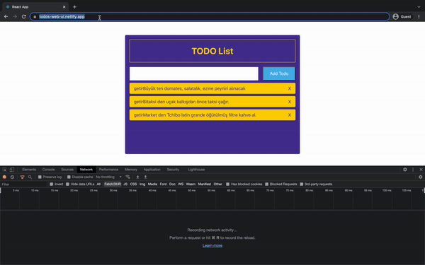

# Todos Web App [Live](https://todos-web-ui.netlify.app/)

## About Project
* Redux Toolkit used.
* Redux AsyncThunk used instead of Saga. 
* React hooks used.
* Designed according to good UI&UX.
* Loading spinner developed and showed loading when backend services calling is pending status.
* Any ui design libraries such as Material, Bootstrap, AntDesign etc... weren't used.

## The Project Usage
* To add new todo task, use input text and Add Todo button.
* To complete/incomplete a task, click text of task in task list.
* To remove task, click X icon of right of task.

## To Run Project
In the project directory, you should do these steps at below:
* ### `npm install`
* if you run backend project(https://github.com/kartalsez/todos-server) at your local,
set API_URL(todos.service.ts) by using LOCAL_SERVER_URL(constants.ts)
* if you don't want to use backend at your local, you don't have to do anything more; 
Backend project already deployed to Heroku.
* ### `npm start`

## Deployment to Netlify
* SERVER_URL defined and setted with server origin url in constants.ts.
* release/todos branch created.
* GitHub and Netlify connected, Deployment branch is release/todos.
* Right now, Automatic Deploys are disabled. We deploy manually.

# Quick Demo

  

